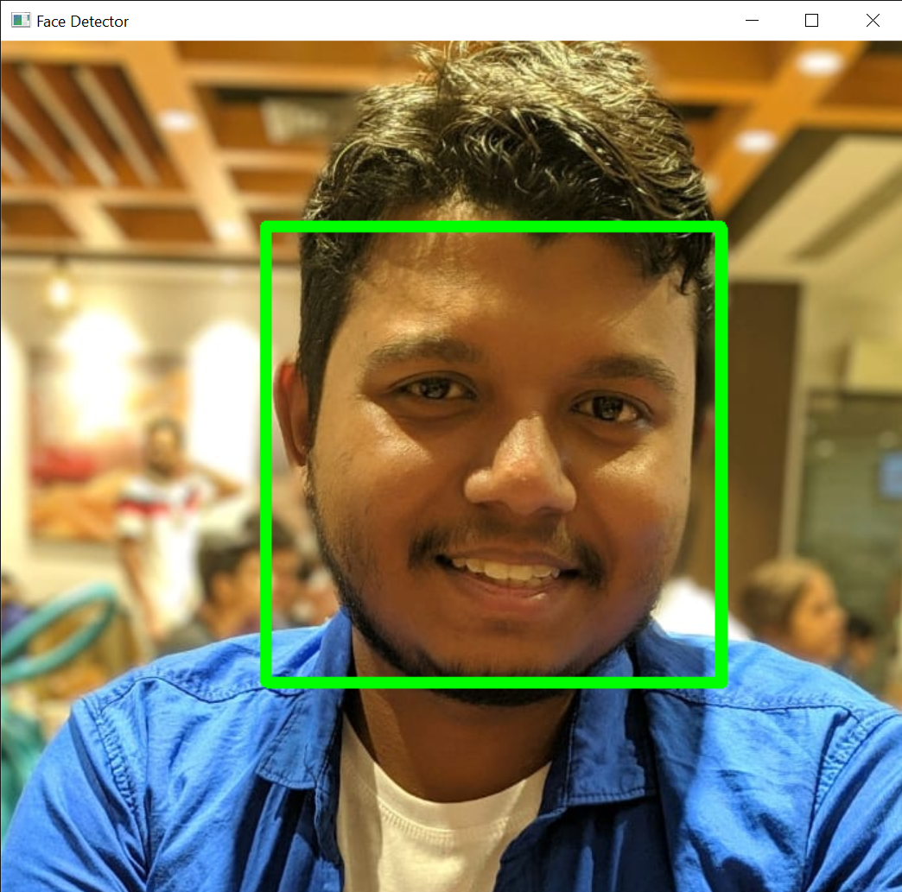

# face-recognition

### Screenshots


## How to make face-recognition module
### 1. Install required Python Packages:

```
pip install opencv-python
```

### 2. Download the pre-trained classifier
 - Download "haarcascade_frontalface_default.xml" from [haarcascade](https://github.com/opencv/opencv/tree/master/data/haarcascades)
 


### 3. Start Testing Face Detection

- use "opencv-face-testing.ipynb" to check if openCV is working or not
```python
# Choose an image to detect faces in
frame = cv2.imread('swagato.jpeg')
```
```python
# Iterate forever over frames
while True:
    # Read the current frame
#     successful_frame_read, frame = webcam.read()
    # Must convert to grayscale
    grayscaled_img = cv2.cvtColor(frame,cv2.COLOR_BGR2GRAY)
    ....
```
&emsp;

- We can see the static image is detected by green rectangle
```python
# Iterate forever over frames
while True:
    # Read the current frame
    successful_frame_read, frame = webcam.read()
    # Must convert to grayscale
    grayscaled_img = cv2.cvtColor(frame,cv2.COLOR_BGR2GRAY)
    ....
```
- now, uncomment the line which we commented in previous step, to fetch live image with webcam


- webcam application will pop up and one rectangle will show up when we run the notebook like above.
- using haarcascade classifier we are detecting faces
- if we press 'q', the webcam window will be closed.

### 4. Collect Data

- run "face-data-collect.ipynb" to collect data as .npy or numpy files
- It will first ask name of the person and the face data will be recorded as a numpy file followd by this
- file will be saved at "data" directory

### 5. Perform Face Recognition 

- run "face-recognition" to test face recognition
